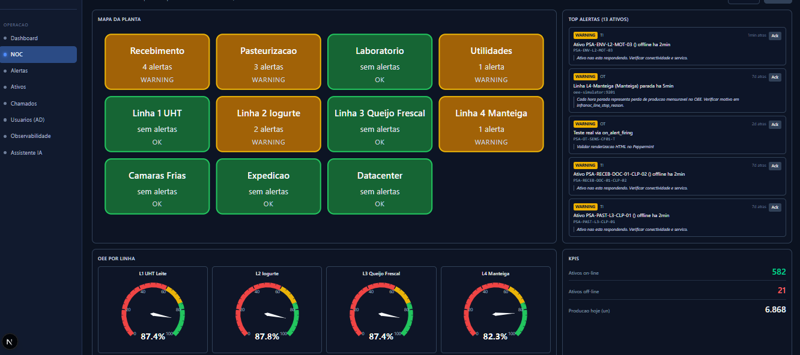
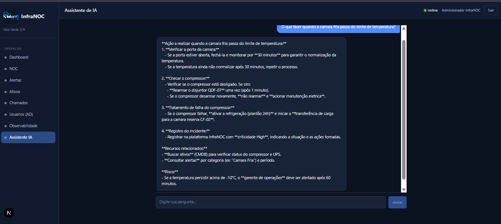
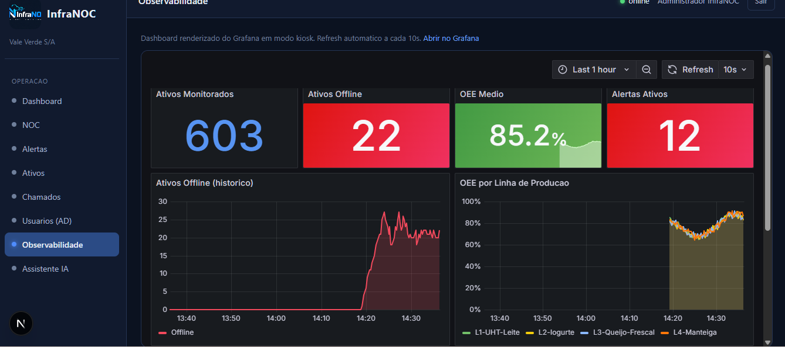
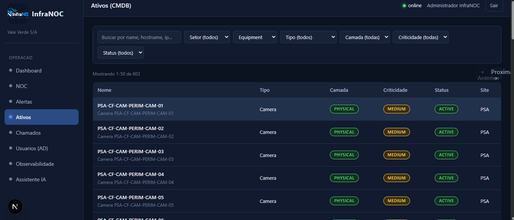
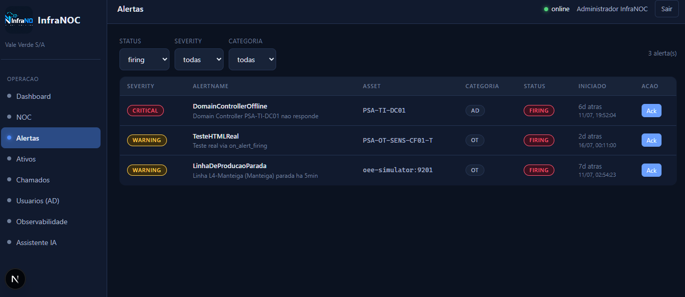
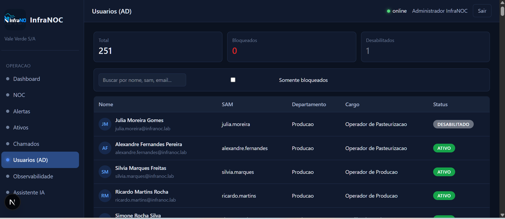
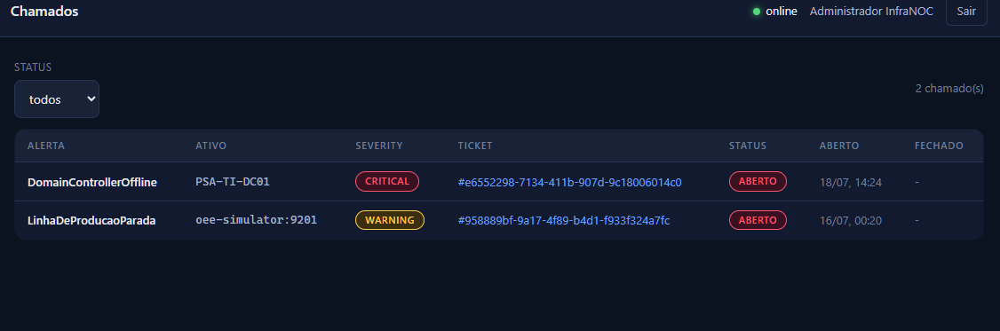
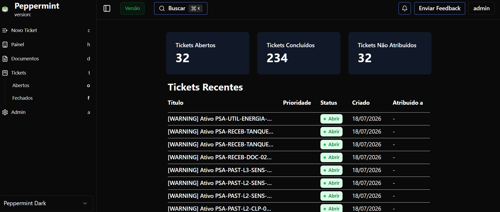
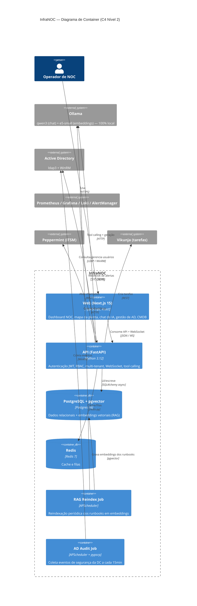

# InfraNOC — Plataforma de NOC, SOC, IAM e IA para Infraestrutura Industrial

**Monitoramento unificado de TI + OT para uma fábrica de laticínios fictícia, com IA local sobre toda a infraestrutura.**


---

## O que é isto

O **InfraNOC** é um Centro de Operações de Rede (NOC) completo, construído do zero para monitorar a infraestrutura fictícia da **Laticínios Vale Verde S/A**: 333 ativos entre servidores, CLPs industriais, câmaras frias, switches, sensores, câmeras e mais — combinando observabilidade de TI e OT, gestão de identidade via Active Directory real, um CMDB completo, integração com ferramentas de ITSM self-hosted e um assistente de IA que roda **100% local**, sem depender de nenhuma API paga.

Não é um CRUD de portfólio. É uma tentativa de reproduzir, em escala de laboratório, os mesmos problemas (e as mesmas soluções) que um NOC real enfrenta todos os dias.

## Dashboard NOC



O mapa da planta acende conforme a severidade dos alertas ativos, com OEE ao vivo por linha de produção e o painel de alertas priorizado por impacto de negócio.

## Assistente de IA — RAG + Tool Calling, 100% local



Pergunte em linguagem natural sobre a infraestrutura ("O que fazer quando a câmara fria passa do limite de temperatura?") e o assistente combina busca semântica sobre os runbooks (RAG via pgvector) com chamadas de ferramentas reais (contagem de ativos, consulta de alertas) — rodando em um modelo Ollama local, sem enviar nenhum dado para fora do ambiente.

## Mais telas

| Observabilidade (Grafana embutido) | CMDB (603 ativos) |
|---|---|
|  |  |

| Alertas com impacto de negócio | Usuários do Active Directory (real) |
|---|---|
|  |  |

| Integração com Peppermint (ITSM) | Painel nativo do Peppermint |
|---|---|
|  |  |

## Arquitetura



Mais diagramas em [`docs/diagrams/`](docs/diagrams/): [C4 Contexto](docs/diagrams/c4-contexto.mmd), [Diagrama ER](docs/diagrams/er-diagram.mmd) e o [fluxo de sequência de um alerta de câmara fria](docs/diagrams/sequence-alerta-camara-fria.mmd) (do sensor até a resposta da IA).

## Stack

| Camada | Tecnologias |
|---|---|
| Backend | Python 3.12, FastAPI, SQLAlchemy 2.0 (async), Alembic, Pydantic v2, python-jose (JWT), passlib/bcrypt, APScheduler |
| Frontend | Next.js 15, TypeScript, Tailwind, shadcn/ui, ECharts, WebSocket |
| Dados | PostgreSQL 16 + pgvector (embeddings), Redis 7 |
| Observabilidade | Prometheus, Loki, Grafana, AlertManager |
| IA | Ollama local (qwen3, embeddings intfloat/multilingual-e5-small) — RAG + tool calling, sem API externa |
| Diretório | Active Directory real (`ldap3` para leitura/escrita, `pypsrp`/WinRM para reset de senha) |
| Integrações | Peppermint (ITSM self-hosted), Vikunja (kanban self-hosted) |
| Infra | Docker, Docker Compose, Caddy (HTTPS), VMware Workstation |

## Módulos

1. Autenticação JWT + RBAC + multi-tenancy
2. Observabilidade de TI e OT (Prometheus/Loki/Grafana/AlertManager)
3. CMDB com 333 ativos e ciclo de vida
4. Dashboard NOC (mapa da planta, OEE, WebSocket em tempo real)
5. Alertas com impacto de negócio e acknowledge
6. Gestão de Active Directory (250 usuários reais — leitura, escrita, reset de senha, auditoria)
7. Integração com Peppermint (abertura automática de chamados)
8. Integração com Vikunja (tarefas)
9. Assistente de IA com RAG (pgvector) e tool calling — 100% local via Ollama
10. Auditoria de todas as ações sensíveis
11. Modo TV / fullscreen para exibição em NOC físico

## Como rodar localmente

Pré-requisitos: Docker + Docker Compose.

```bash
git clone https://github.com/RafaGarciaDev/infranoc.git
cd infranoc
cp .env.example .env   # edite com suas variáveis (senhas, INFRANOC_AI_MODEL etc.)
docker compose -f compose/docker-compose.dev.yml up -d --build
docker compose exec api uv run alembic upgrade head
docker compose exec api uv run python -m app.seed
```

Acesse `http://localhost:3000` — login padrão do seed: `admin@valeverde.com` / `admin`.

> O módulo de Active Directory (LDAP/WinRM) espera um domínio real acessível na rede — no ambiente de desenvolvimento, isso roda contra uma VM de laboratório (Windows Server + AD). Sem essa VM, os demais módulos funcionam normalmente; só a gestão de AD fica indisponível.

## Testes

Suíte de testes com destaque para o **teste de isolamento multi-tenant** (garante que dados de um tenant nunca vazam para outro, mesmo com um bug de query). CI roda a suíte completa a cada push.

```bash
cd backend
uv run pytest
```

## Decisões de arquitetura (ADRs)

Registro das decisões técnicas mais relevantes em [`docs/adrs/`](docs/adrs/), incluindo a arquitetura híbrida de tool calling + RAG do assistente de IA.

## Roadmap

**Feito:**
- [x] Autenticação, RBAC, multi-tenancy
- [x] Observabilidade TI + OT com 333 ativos
- [x] CMDB completo
- [x] Dashboard NOC em tempo real (WebSocket)
- [x] Gestão de Active Directory real (250 usuários)
- [x] Integração com Peppermint e Vikunja
- [x] Assistente de IA local (RAG + tool calling)

**Próximos passos:**
- [ ] Backup (Veeam)
- [ ] Segurança/SIEM (Wazuh + MITRE ATT&CK)
- [ ] Automação de rede (Mikrotik/Ubiquiti)
- [ ] Help Desk ampliado
- [ ] VPN + gestão de usuários remotos
- [ ] Deploy público com HTTPS

## Autor

**Rafael Farias Garcia**
[LinkedIn](https://www.linkedin.com/in/rafael-farias-garcia-6617b246) · [GitHub](https://github.com/RafaGarciaDev)

## Licença

MIT — veja [LICENSE](LICENSE).
